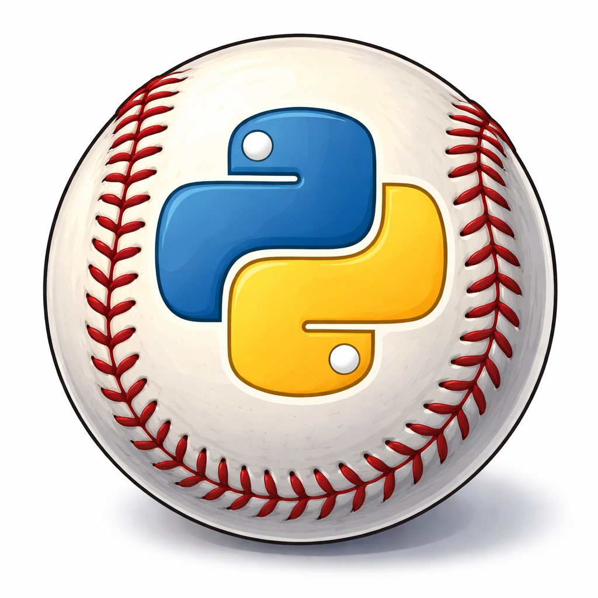

# Learn To Code With Baseball ⚾️ 🏟️ 🧢
love baseball? Want to code? Start here. Using Python and baseball's biggest stars and stats, we'll learn variables, loops, lists, and more! 

> This project is in progress and open to feedback. 💡

**Why Python?** 

Python is one of the easiest programming languages to read and write, which makes it perfect for learning to code for the first time. Python is also lightweight and great for data - Python doesn’t force you to memorize lots of symbols. You focus on what you want to do, not how complicated the language is.

Python is like learning the rules of baseball before learning advanced analytics — it builds a foundation you can grow on.

## Step 1: Check if Python is already installed (macOS)
Open Terminal

***Applications → Utilities → Terminal***

Run:

```python3 --version```

What you’ll see

✅ Python 3.x.x → Python is installed

❌ command not found → we’ll install it

macOS sometimes ships with a system Python — we will ***NOT*** use python, only python3.

## Step 2: Install Homebrew (recommended) 

What is Homebrew? Homebrew is a popular, free, open-source package manager for macOS and Linuxthat simplifies installing, updating, and managing software from the command line. 

So to install homebrew, we'll simply copy the following command in our terminal. (Open Terminal appliction) 

```/bin/bash -c "$(curl -fsSL https://raw.githubusercontent.com/Homebrew/install/HEAD/install.sh)"```

After it finishes, let's verify that it was installed by checking the version. 

```brew --version```

### Step 2.2: Install Python 

```brew install python```

Verify: 

```bash
python3 --version
pip3 --version
```

We should see something like this: 

```bash
Python 3.12.x
pip 23.x
```
## Step 3: Set up project folder 

In terminal, first, we'll navigate to our Desktop. (alternatively, we can use another location but for beginners, I recommed Desktop)

```bash
mkdir baseball_python
cd baseball_python
```

```cd``` changes our directory to baseball_pyhton 

Create our first file: 

```bash
touch baseball.py
```

💥 You created your first python file! Congrats. 

## Step 4: Choose an editor (VS Code is recommended) 

Install VSCode 

Download from [VSCode](https://code.visualstudio.com)

Once downloaded, we can open up our project. 

In your terminal window, we can simply type: 

```bash
code .
``` 

The project should open in VSCode. 

You can also open VSCode, select Open and select your ```baseball.py``` file. 

**If ```code``` doesn't work, ```Cmd + Shift + P``` -> Shell Command: Install 'Code' command**

## Step 5: Run your first Python program 

Open ```baseball.py``` and type (or copy): 

```python
print("Hello, baseball Python!")
```
### Step 5.2 

> ❗️ you will need to add the Python extension in VSCode. It should prompt you when adding a python file.

In VS Code:
1. Click the Extensions icon on the left sidebar
2. Search for Python
3. Install Python

This extension gives us:
* Syntax highlighting
* Helpful error messages
* Easy run buttons

Run your file either in VSCode or in Terminal. 

In VSCode, select ▶Run. The intergrated terminal should open and you should see: 

```Hello, baseball Python!```

Or in Terminal, type: 

```bash 
python3 baseball.py
```

You'll then see: 

```Hello, baseball Python!```

🎉 That’s it. You just ran your first Python file.

**Why this matters** 
* ```print()``` shows output
* ```.py``` files are Python programs
* ```python3 filename.py``` runs the file in Terminal

## Step 6: Install Baseball-Friendly Libaries 

Python really shines when working with data, and baseball is full of it.

We’ll install a few libraries that help us work with stats.

### Step 6.2: Install the libraries 
```bash
pip install pandas numpy matplotlib
```

what these do: 
* **pandas** → tables of player stats
* **numby** → math and calculations
* **matplotlib** → charts and graphs

## Steph 6.3: Quick Test 

Create a new file: 

```bash
touch stats.py
```

Open it and add: 

```python
import pandas as pd

data = {
    "player": ["Judge", "Ohtani", "Trout"],
    "hits": [2, 3, 1],
    "at_bats": [4, 5, 3]
}

df = pd.DataFrame(data)
df["average"] = df["hits"] / df["at_bats"]

print(df)
```

Run it and you should see the following output: 

| Player | Hits | At Bats | Batting Average |
|--------|------|---------|-----------------|
| Judge  | 2    | 4       | 0.500           |
| Ohtani| 3    | 5       | 0.600           |
| Trout | 1    | 3       | 0.333           |

👏 Now we're ready to code with baseball ⚾️

## Step 7: Variables (using Baseball stats) 

Before we can do anything interesting in Python, we need to understand variables.

**What is a variable?**

A variable is a named container that stores a value.

In baseball terms:
*A stat (hits, at-bats, runs) is a value

*The stat name is the variable

Example: open ```baseball.py``` and replace the code with this: 

```python
player_name = "Judge"
hits = 2
at_bats = 4
```

Here's what's happening:

* ```player_name``` stores text (a string)
* ```hits``` stores a number
* ```at_bats```` stores a number

**Using variables together** 

Now let’s calculate a batting average:

```python
batting_average = hits / at_bats

print(player_name)
print(batting_average)
```

When we run the file, you should see: 

```nginx
Judge
0.5
```

**Making the output easier to read**

Python lets us format output so it looks nicer:

```python 
print(f"{player_name}'s batting average is {batting_average:.3f}")
```

Output: 
```vbnet 
Judge's batting average is 0.500
```

Why Variables matter: 

* Store baseball stats
* Reuse values
* Change data without rewriting code

If Judge gets another hit, we only change one number:

```python 
hits = 3
```

Everything else updates automatically. 

**Takeaways** 

* Variables store information
* Numbers don’t need quotes
* Text does need quotes
* Variables make stats reusable and flexible

## Step 8: Data Types (Strings vs Numbers)

Python needs to know what kind of data it’s working with.

These are called data types.

For now, we’ll focus on the two most important ones:

* **Strings** (text)
* **Numbers** (integers and decimals)
**Strings (text)** 

A string is any text wrapped in quotes.

Baseball examples:

```python
player_name = "Judge"
team = "Yankees"
position = "RF"
```

Key rule: 

* Strings must be inside quotes (" " or ' ')

If you forget the quotes, Python thinks it’s a variable and will throw an error.

**Numbers** 

Numbers are used for math and do **NOT** use quotes.

```python
hits = 2
at_bats = 4
batting_average = 0.500
```

There are two main number types you’ll see:

**Integers (whole numbers)**
```python
hits = 2
at_bats = 4
```

**Floats (decimals)**
```python
batting_average = 0.500
```

**Why data types matter**

Python treats strings and numbers very differently.

This works (math with numbers):

```python
hits = 2
at_bats = 4
print(hits / at_bats)
```

Output:

```nginx
0.5
```

This does NOT work (math with strings):

```python
hits = "2"
at_bats = "4"
print(hits / at_bats)
```

❌ Python will error because text can’t be divided.

**Mixing strings and numbers (the right way)**

If you want to print text and numbers together, use an f-string:

```python
player_name = "Judge"
hits = 2
at_bats = 4

average = hits / at_bats

print(f"{player_name} has a batting average of {average:.3f}")
```

Output:

```nginx
Judge has a batting average of 0.500
```

**Checking a variable’s data type**

You can ask Python what type something is:

```python
print(type(player_name))
print(type(hits))
print(type(average))
```

Output:

```kotlin
<class 'str'>
<class 'int'>
<class 'float'>
```

Common beginner mistake 🚨

❌ This looks right but is wrong:

```python
hits = "2"
```

✅ This is correct:

```pyhton
hits = 2
```

**Remember:** 

* Quotes = text
* No quotes = number

**Key takeaways**

* Strings = text (names, teams, positions)
* Integers = whole numbers (hits, at-bats)
* Floats = decimals (averages)
* Python needs correct data types to do math
  
## Step 9: Lists (storing a roster) 

So far, we’ve worked with one player at a time.
But baseball is a team sport — we need a way to store multiple players together.

That’s where **lists** come in.

**Creating a List** 

```python
players = ["Judge", "Ohtani", "Trout"]
```

Things to remember:

* Lists use square brackets []
* Items are separated by commas
* Order matters

**Accessing items in a list**

Each item in a list has a position called an index.
Indexes start at 0, not 1.

```python
print(players[0])
print(players[1])
print(players[2])
```

Output:

```nginx
Judge
Ohtani
Trout
```

**Adding players to a list**

You can add a new player to the roster using .```append()``` :

```python
players.append("Betts")
print(players)
```

Output:

```css
['Judge', 'Ohtani', 'Trout', 'Betts']
```

**Counting players on the roster**

To see how many players are in the list, use ```len()``` :

```python
print(len(players))
```

Output: 

```nginx
4
```

**Lists of numbers (baseball stats)**

Lists aren’t just for names — they’re great for stats too:

```python
hits = [2, 3, 1]
at_bats = [4, 5, 3]
```

Each position lines up with the same player:

* ```hits[0]``` → Judge
* ```hits[1]``` → Ohtani
* ```hits[2]``` → Trout

**Using list values in calculations** 

```pyhton
average = hits[0] / at_bats[0]
print(average)
```

Output:

```nginx
0.5
```

**Common beginner mistakes 🚨**

❌ Using parentheses instead of brackets:

```python
players = ("Judge", "Ohtani", "Trout")
```

❌ Forgetting indexes start at 0:

```python
print(players[1])
```

(This prints the second player, not the first.)

**Key takeaways**

* Lists store multiple values
* Lists use square brackets
* Indexes start at 0
* Lists are perfect for rosters and stat groups

## Step 10: Dictionaries (Player Cards)

Lists are great for storing multiple values, but they don’t tell us what each value represents.

For example, this works:

```python
hits = [2, 3, 1]
```

But which number is hits? At-bats? Walks?

That’s where dictionaries come in.

**What is a dictionary?**

A dictionary stores data as key–value pairs.

Think of a dictionary like a player card:

* The key is the stat name

* The value is the stat itself

**Creating a dictionary**

Here’s a dictionary for one player:

```python
player = {
    "name": "Judge",
    "hits": 2,
    "at_bats": 4
}
```

Things to notice:

* Dictionaries use **curly braces { }**

* Keys are strings

* Each key maps to a value using **:**

**Accessing values in a dictionary**

You access values by using the key name:

```python
print(player["name"])
print(player["hits"])
print(player["at_bats"])
```

Output: 

```nginx
Judge
2
4
```

**Using dictionary values in calculations**

```python
average = player["hits"] / player["at_bats"]
print(average)
```

Output: 

```nginx
0.5
```
Now the code clearly shows what stat is being used.
